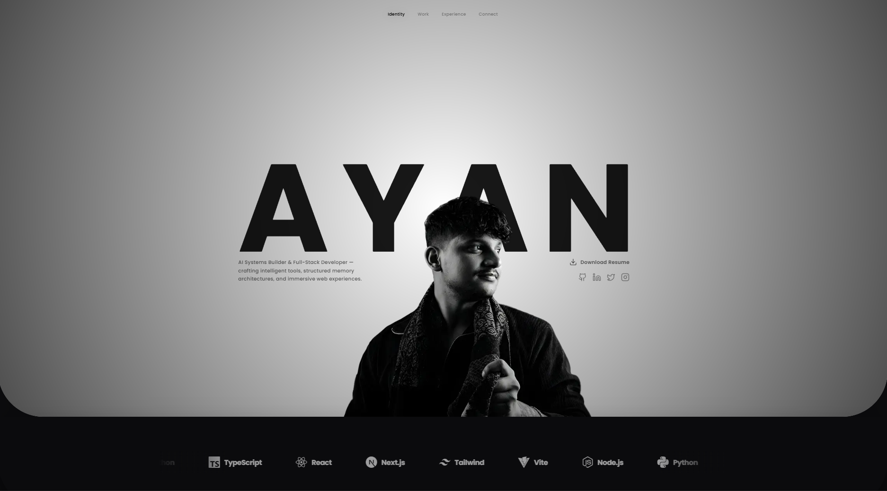

# Cinematic Glass Portfolio
 
<div align="center">

[](https://ayan-mukherjee.vercel.app/)

</div>

A high-fidelity, immersive personal portfolio website built with **Next.js 16**, **TypeScript**, and **Tailwind CSS v4**. This project features a unique "Glass Stack" design system, cinematic aesthetics, and smooth scroll-triggered animations.



## 🌟 Features

-   **Cinematic Design System**: a custom dark mode aesthetic (`#0b0b0d`) with deep backdrop blurs, gradients, and soft lighting effects.
-   **Glass Stack Layout**: A vertical scrolling stack of glass cards with parallax-like depth.
-   **Bento Grid Layouts**: Responsive, grid-based layouts for the Identity and Connect sections.
-   **Interactive Carousels**: Auto-cycling project showcases with hover-pause functionality and smooth transitions.
-   **Advanced Animations**:
    -   Scroll-triggered title reveals using `framer-motion`.
    -   Entry/Exit animations optimized for performance.
    -   Interactive hover states for all cards and buttons.
-   **Responsive Navigation**:
    -   Floating capsule navbar with intersection-based active state tracking.
    -   Seamless cross-page navigation (`/works`, `/labs`) with back support.

## 🛠️ Tech Stack

-   **Framework**: [Next.js 16 (App Router)](https://nextjs.org/)
-   **Language**: [TypeScript](https://www.typescriptlang.org/)
-   **Styling**: [Tailwind CSS v4](https://tailwindcss.com/)
-   **Animation**: [Framer Motion](https://www.framer.com/motion/)
-   **Icons**: [Lucide React](https://lucide.dev/)

## 🚀 Getting Started

### Prerequisites

-   Node.js 18+ 
-   npm or pnpm

### Installation

1.  **Clone the repository**:
    ```bash
    git clone https://github.com/yourusername/portfolio.git
    cd portfolio
    ```

2.  **Install dependencies**:
    ```bash
    npm install
    # or
    pnpm install
    ```

3.  **Run the development server**:
    ```bash
    npm run dev
    ```

    Open [http://localhost:3000](http://localhost:3000) with your browser to see the result.

4.  **Build for production**:
    ```bash
    npm run build
    npm start
    ```

## 📂 Project Structure

-   `app/`: App Router pages and global layouts.
-   `components/`: Reusable UI components.
    -   `GlassSection.tsx`: The core container component for the glass aesthetic.
    -   `ProjectCarousel.tsx`: Reusable carousel for Works and Labs.
    -   `Navbar.tsx`: Smart navigation component.
-   `public/`: Static assets (images, fonts).

## 🎨 Customizing

1.  **Content**: Edit `app/page.tsx` to update your bio, social links, and bento grid layout.
2.  **Projects**: Update the `works` and `labs` arrays in `app/page.tsx`, `app/works/page.tsx`, and `app/labs/page.tsx`.
3.  **Profile Picture**: Replace `public/my pfp.jpg` with your own image.

## 🤖 AI CLI Usage

To interact with the AI CLI and fetch generated files, you can use the following methods:

### Option 1: PowerShell Helper Script (Recommended for Windows)
Use the provided `ask.ps1` script to handle URL encoding and file saving automatically.

```powershell
.\ask.ps1 -q "your prompt here" -filename "output.py"
```

### Option 2: Direct curl (Windows PowerShell)
To use `curl` in PowerShell, you must use `curl.exe` and specify the output filename manually with the `-o` flag.

```powershell
curl.exe "https://cli-ayan-ai.vercel.app/api/ask?q=hello+world&filename=hello.py" -o hello.py
```

## 📄 License

This project is open source and available under the [MIT License](LICENSE).
